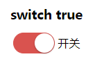

## vue-pageman

a vue switch component

### Install

```bash
npm install vue-switch -S

yarn add vue-switch
```

### Quickstart
```javascript
require('vue-pager/dist/vue-switch.css');

// in ES6 modules
import { switchc } from 'vue-switch';

// in CommonJS
const { switchc } = require('vue-switch');

// in Global variable
const { switchc } = VueSwitch;

Vue.component('c-switch',switchc);
```
```html
<c-switch v-model="checked" :text="text"></c-switch>
```

### Props
Parameter | Type | required | Default | Description
--------- | ---- | -------- | ------|-----------
value | `boolean`| required | false | switch checked status, use width v-model
text    | `string` | optional |       | switch text on right
width   | `number`| optional | 60 |  switch width
height  | `number`| optional | 30 |  switch height
active-color |`string`| optional | '#0275d8' | switch checked color

### Preview

